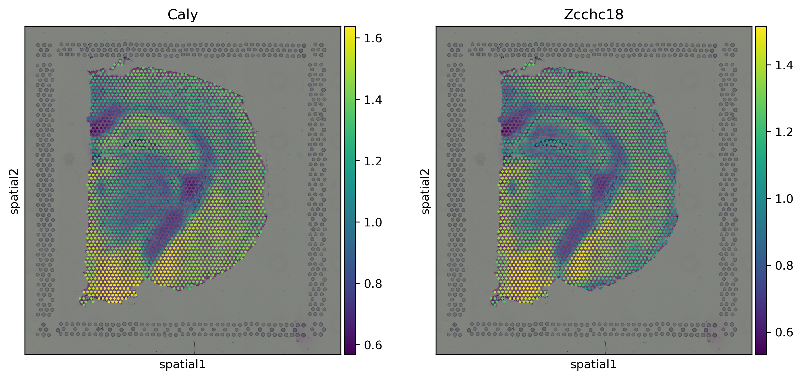

# LEGEND Tutorial

**Authors:** [Tao Deng](https://torydeng.github.io/)<sup>§</sup>, Kaichen Xu, Yucheng Xu, Yuwei Hu, Zhihua Liu, Siyu chen, [Hao Wu](https://www.haowulab.org/)<sup>\*</sup>, and [Xiaobo Sun](https://scholar.google.com/citations?user=l56IWfgAAAAJ&hl=en)<sup>§\*</sup>

<sup>§</sup> Equal contribution. <sup>\*</sup> Corresponding authors.

**Maintainer:** [Tao Deng](https://torydeng.github.io/) (taodeng@link.cuhk.edu.cn)

**Latest revision:** 23/12/2023

---

## Introduction

Exploring co-expressed genes is essential for revealing biologically co-functional genes. However, existing methods for this purpose rely solely on sc/snRNA-seq or spatially-resolved transcriptomic (SRT) data, leading to weaker co-functionality among identified genes. We present `LEGEND` (mu**L**timodal co-**E**xpressed **GE**nes fin**D**er), a novel method that performs integrated gene clustering on sc/snRNA-seq and SRT data for identifying genes co-expressed at both the cell type and tissue domain levels.


The above figure illustrates the workflow of `LEGEND`. Under the framework of information theory, `LEGEND` estimates gene relevance, redundancy and complementarity in both SRT and sc/snRNA-seq datasets in a pseudo-semi-supervised manner. This information is used to construct a gene-gene redundancy graph, on which hierarchical gene clustering is performed using relative redundancy index (RRI) between neighboring gene nodes. The resulting clusters contain genes that are co-expressed at both tissue domain and cell type levels, suggesting a higher likelihood of biological co-functionality.

## Installation

### Install Python and graph-tool

We recommend you installing Python and the dependencies of `LEGEND` using [Conda](https://docs.conda.io/en/latest/), as one of the dependencies, [graph-tool](https://graph-tool.skewed.de/static/doc/index.html), is only available through this platform:

```shell
# Create a conda env named "legend", and install Python 3.9 and the graph-tool package
conda create --name legend python=3.9 graph-tool -c conda-forge
# Activate the env
conda activate legend
```

### Install LEGEND

You can download the package from GitHub and install it locally using the following commands in your terminal:

```shell
# Ensure you have Python, pip, and git installed on your system.
# Clone the package from GitHub
git clone https://github.com/ToryDeng/LEGEND.git
# Navigate to the LEGEND directory
cd LEGEND/
# Install the package using pip
pip install dist/LEGEND-0.1.0-py3-none-any.whl  
```

You can verify that `LEGEND` has been successfully installed by executing:

```shell
pip show LEGEND
```

And if everything works fine, you will get output like:

```text
Name: LEGEND
Version: 0.1.0
Summary: An integrative algorithm for identifying co-expressed and cofunctional genes in multimodal transcriptomic sequencing data
Home-page: https://github.com/ToryDeng/LEGEND
Author: Tao Deng
Author-email: taodeng@link.cuhk.edu.cn
License: GPL v3
Location: /usr/local/anaconda3/envs/legend/lib/python3.9/site-packages
Requires: anndata, hdbscan, igraph, leidenalg, loguru, numpy, opencv-python, pandas, scanpy, scikit-learn, scipy, setuptools, SpaGCN, squidpy, torch
Required-by:
```

## Quick Start

This quick start guide is designed to get you up and running with `LEGEND`. It is recommended to follow this tutorial in a Jupyter Notebook, which provides an interactive environment for executing the Python code necessary for this guide. If you do not have Jupyter installed, follow the installation instructions in the [Project Jupyter Documentation](https://docs.jupyter.org/en/latest/install.html).

### Import Packages

The following code snippet imports `LEGEND` alongside some additional packages that will be used in the tutorial:

```python
import LEGEND as lg
import scanpy as sc
import squidpy as sq
import STAGATE_pyG

from sklearn.metrics import adjusted_rand_score as ari
```

In this tutorial, we utilize [STAGATE](https://doi.org/10.1038/s41467-022-29439-6) to denoise gene expressions from the SRT dataset. `STAGATE` is available in two versions: one based on TensorFlow, and another using the [PyG](https://pyg.org/) library. We will be using the PyG version, `STAGATE_pyG`. `STAGATE_pyG` is not included in `LEGEND`'s dependencies, so make sure to install it separately by the instructions in its [documentation](https://stagate.readthedocs.io/en/latest/Installation_pyG.html).

### Obtain the Datasets

We will be working with two mouse brain datasets featured in our paper. The scRNA-seq dataset is publicly available in the GEO database under the accession number [GSE115746](https://www.ncbi.nlm.nih.gov/geo/query/acc.cgi?acc=GSE115746). The SRT dataset is hosted on the [10x Genomics official site](https://support.10xgenomics.com/spatial-gene-expression/datasets/1.1.0/V1_Adult_Mouse_Brain). These datasets can also be downloaded via [squidpy](https://squidpy.readthedocs.io/en/stable/api.html#module-squidpy.datasets).  Below, we will use `Squidpy` and `OpenCV` to load the datasets along with the H&E-stained image:

```python
# Get the scRNA-seq dataset
adata_rna = sq.datasets.sc_mouse_cortex()

# Get the SRT dataset and its H&E image
adata_st = sq.datasets.visium_hne_adata()
img = cv2.imread("/path/to/visium_hne.tiff")
```

### Data Preprocessing

Data preprocessing is vital to ensure the quality of downstream analyses. We start by using the raw counts present in both datasets:

```python
adata_rna = adata_rna.raw.to_adata()
adata_st = adata_st.raw.to_adata()
```

Next, we filter out low-expression genes to reduce the dimensionality of the data and to focus on the most informative features:

```python
# Filter genes based on the number of cells with expression
sc.pp.filter_genes(adata_rna, min_cells=3)
sc.pp.filter_genes(adata_st, min_cells=3)
```

The variables `adata_rna` and `adata_st` are `AnnData` objects, which are data structures for storing gene expression data along with annotations of cells, spots, and genes from the scRNA-seq and SRT datasets, respectively. The `img` variable is a `NumPy` array representing an H&E stained image of brain tissue and has dimensions (11757, 11291, 3), corresponding to its width, height, and color channels.

To inspect these datasets and learn more about their structure, simply enter `adata_rna` or `adata_st` in a new Jupyter notebook cell and execute the cell. This will display a summary of the dataset's contents, including the dimensions of the expression matrix and stored annotations. If you encounter any issues, make sure that all prerequisite software packages and their dependencies have been installed properly.

```python
adata_rna
```

```text
AnnData object with n_obs × n_vars = 21697 × 36825
    obs: 'sample_name', 'organism', 'donor_sex', 'cell_class', 'cell_subclass', 'cell_cluster', 'n_genes_by_counts', 'log1p_n_genes_by_counts', 'total_counts', 'log1p_total_counts', 'pct_counts_in_top_50_genes', 'pct_counts_in_top_100_genes', 'pct_counts_in_top_200_genes', 'pct_counts_in_top_500_genes', 'total_counts_mt', 'log1p_total_counts_mt', 'pct_counts_mt', 'n_counts'
    var: 'mt', 'n_cells_by_counts', 'mean_counts', 'log1p_mean_counts', 'pct_dropout_by_counts', 'total_counts', 'log1p_total_counts', 'n_cells'
    uns: 'cell_class_colors', 'cell_subclass_colors', 'hvg', 'neighbors', 'pca', 'umap'
    obsm: 'X_pca', 'X_umap'
    obsp: 'connectivities', 'distances'
```

```python
adata_st
```

```text
AnnData object with n_obs × n_vars = 2688 × 18078
    obs: 'in_tissue', 'array_row', 'array_col', 'n_genes_by_counts', 'log1p_n_genes_by_counts', 'total_counts', 'log1p_total_counts', 'pct_counts_in_top_50_genes', 'pct_counts_in_top_100_genes', 'pct_counts_in_top_200_genes', 'pct_counts_in_top_500_genes', 'total_counts_mt', 'log1p_total_counts_mt', 'pct_counts_mt', 'n_counts', 'leiden', 'cluster'
    var: 'gene_ids', 'feature_types', 'genome', 'mt', 'n_cells_by_counts', 'mean_counts', 'log1p_mean_counts', 'pct_dropout_by_counts', 'total_counts', 'log1p_total_counts', 'n_cells'
    uns: 'cluster_colors', 'hvg', 'leiden', 'leiden_colors', 'neighbors', 'pca', 'rank_genes_groups', 'spatial', 'umap'
    obsm: 'X_pca', 'X_umap', 'spatial'
    obsp: 'connectivities', 'distances'
```

### Run LEGEND

`LEGEND` operates by calculating gene relevance, redundancy, and complementarity within each data modality (scRNA-seq or SRT) before integrating the results across different modalities.

#### Compute on a Single Modailty 

The `lg.GeneClust` function executes gene clustering for each dataset individually. Begin by setting common arguments for the function call:

```python
args = {
        "version": "ps",
        "verbosity": 0,
        "relevant_gene_pct": 10,
        "return_info": True,
    }
```
Let's elaborate on these parameters:

- **version:** `LEGEND` provides two variants for gene clustering: `fast` and `ps`. The `fast` version quickly clusters genes but doesn't assess gene relevance, redundancy, or complementarity. The `ps` version, recommended for multi-modality analysis, performs these comprehensive computations.
- **verbosity:** The verbosity level. `0` displays only warnings and errors. `1` also shows info messages. `2`, also shows debug messages.
- **relevant_gene_pct:** The percentage of genes to include as relevant. Here we use a relatively small value to reduce the computational time required for this tutorial.
- **return_info:** Whether intermediate results are returned alongside the selected genes. Set to `True` for a more in-depth review of the clustering process.

Now, apply `lg.GeneClust` to the scRNA-seq dataset:

```python
info_rna, sc_genes = lg.GeneClust(
    adata_rna, n_obs_clusters=23, modality="sc", **args
)
```

`n_obs_clusters` is the number of clusters in cell/spots clustering. It is used in indentification of high-confidence cells/spots.
For the scRNA-seq dataset, we specify `n_obs_clusters=23` which is equal to the true number of cell types. `modality="sc"` indicates the modality is scRNA-seq. `info_rna` is an `AnnData` object storing intermediate results, and `sc_genes` is a `NumPy` array comprising selected genes.

If `adata.X` contains normalized counts, a warning may appear during processing:

```text
2023-12-21 22:56:16.462 | WARNING  | LEGEND._validation:check_raw_counts:71 - Will directly use the possible normalized counts found in `adata.X`.
```

This indicates that `LEGEND` is working with a potentially normalized expression matrix. `LEGEND` prefers raw counts but can work on normalized counts. In the latter case it will raise this warning to alert the user to verify the data type being used in the analysis.

Inspecting the `info_rna` by executing `info_rna` in a Jupyter cell will reveal its structure:

```python
info_rna
```

```text
AnnData object with n_obs × n_vars = 3889 × 3683
    obs: 'sample_name', 'organism', 'donor_sex', 'cell_class', 'cell_subclass', 'cell_cluster', 'n_genes_by_counts', 'log1p_n_genes_by_counts', 'total_counts', 'log1p_total_counts', 'pct_counts_in_top_50_genes', 'pct_counts_in_top_100_genes', 'pct_counts_in_top_200_genes', 'pct_counts_in_top_500_genes', 'total_counts_mt', 'log1p_total_counts_mt', 'pct_counts_mt', 'n_counts', 'cluster'
    var: 'mt', 'n_cells_by_counts', 'mean_counts', 'log1p_mean_counts', 'pct_dropout_by_counts', 'total_counts', 'log1p_total_counts', 'n_cells', 'relevance', 'outlier_score', 'cluster', 'representative'
    uns: 'cell_class_colors', 'cell_subclass_colors', 'hvg', 'neighbors', 'pca', 'umap', 'pearson_residuals_normalization', 'MST'
    obsm: 'X_pca', 'X_umap'
    varm: 'X_pca'
    obsp: 'connectivities', 'distances'
    varp: 'redundancy'
```

Key intermediate results include:
- obs['cluster']: The high-confidence cell cluster labels. Low-confidence cell clusters are filtered.
- var['relevance']: Per-gene relevance scores. Irrelevant genes are filtered.
- var['outlier_score']: Gene outlier scores computed by [GLOSH](https://doi.org/10.1145/2733381) (Global-Local Outlier Score from Hierarchies) outlier detection algorithm.
- var['cluster']: Gene cluster labels.
- var['representative']: Boolean indicating if a gene is considered representative of a cluster. 
- varp['redundancy']: Pairwise gene redundancy values.
- uns.['MST']: The maximum-spanning tree (MST) from the undirected complete gene-gene graph.


```python
info_st, st_genes = lg.GeneClust(
    adata_st, img, n_obs_clusters=15, modality="st", alpha=0.7, **args
)
```

Here, `modality="st"` specifies that the dataset is SRT. The `alpha` parameter adjusts the size of each spatial cluster's neighborhood, influencing the selection of highly confident spots.

The resulting `AnnData` object (`info_st`) and the associated dataset details can be similarly inspected to understand the generated clusters, relevance values, and redundancy scores specific to the SRT dataset.

```python
info_st
```

```text
AnnData object with n_obs × n_vars = 1607 × 1808
    obs: 'in_tissue', 'array_row', 'array_col', 'n_genes_by_counts', 'log1p_n_genes_by_counts', 'total_counts', 'log1p_total_counts', 'pct_counts_in_top_50_genes', 'pct_counts_in_top_100_genes', 'pct_counts_in_top_200_genes', 'pct_counts_in_top_500_genes', 'total_counts_mt', 'log1p_total_counts_mt', 'pct_counts_mt', 'n_counts', 'leiden', 'cluster'
    var: 'gene_ids', 'feature_types', 'genome', 'mt', 'n_cells_by_counts', 'mean_counts', 'log1p_mean_counts', 'pct_dropout_by_counts', 'total_counts', 'log1p_total_counts', 'n_cells', 'relevance', 'outlier_score', 'cluster', 'representative'
    uns: 'cluster_colors', 'hvg', 'leiden', 'leiden_colors', 'neighbors', 'pca', 'rank_genes_groups', 'spatial', 'umap', 'log1p', 'spatial_neighbors', 'MST'
    obsm: 'X_pca', 'X_umap', 'spatial'
    varm: 'X_pca'
    obsp: 'connectivities', 'distances', 'spatial_connectivities', 'spatial_distances'
    varp: 'redundancy'
```

By running `LEGEND` in this way, you efficiently process both scRNA-seq and SRT datasets to determine highly relevant and non-redundant genes, paving the way for the multimodal transcriptomic analysis. 


#### Integration

To perform integration using the `lg.integrate` function, pass in the `AnnData` objects (`info_rna` and `info_st`) that contain the intermediate results:

```python
integration_info, integrated_genes = lg.integrate(
    adata_rna=info_rna, adata_st=info_st, return_info=True
)
```

`integration_info` holds the integrated results, such as gene relevance and redundancy scores that integrate information across both modalities. `integrated_genes` contains the final selection of genes when considering both scRNA-seq and SRT data.

The output of the integration is summarized in informational logs that detail the analysis steps:


```text
2023-12-23 23:24:07.948 | INFO  | Detected 1020 genes shared by SRT and scRNA-seq.
2023-12-23 23:24:08.483 | INFO  | Start to compute complementarity on SRT data...
2023-12-23 23:24:08.485 | INFO  | Computing gene complementarity...
2023-12-23 23:24:15.746 | INFO  | Gene complementarity computed.
2023-12-23 23:24:15.749 | INFO  | Start to compute complementarity on scRNA-seq data...
2023-12-23 23:24:15.749 | INFO  | Computing gene complementarity...
2023-12-23 23:24:23.683 | INFO  | Gene complementarity computed.
2023-12-23 23:24:23.829 | INFO  | Selected 346 genes.
```

These messages indicate that `LEGEND` has identified `1020` genes in common between the two datasets and has computed their complementarity within each modality. The final selection includes `346` genes that likely have significant roles across the examined modalities.

> If your downstream analysis, such as domain detection, requires a broader gene set, you may adjust the `relevant_gene_pct` parameter that was set earlier in the `lg.GeneClust` function. Increasing this value allows for a more inclusive gene selection.


## Applications

### Co-expressed genes

Genes in the same cluster are likely to be co-expressed and show similar spatial expression patterns. To highlight the co-expression patterns of genes within clusters identified by `LEGEND`, we first denoise the gene expressions in the SRT dataset using `STAGATE`.

```python
# Normalize total expression
sc.pp.normalize_total(adata_st, target_sum=1e4)
# Logarithmize the expression values
sc.pp.log1p(adata_st)

# Calculate the spatial graph for denoising
STAGATE_pyG.Cal_Spatial_Net(adata_st, rad_cutoff=150)
# Train STAGATE and save the reconstructed expression matrix in `adata_st`
adata_st = STAGATE_pyG.train_STAGATE(adata_st, save_reconstrction=True)
```

```text
------Calculating spatial graph...
The graph contains 15580 edges, 2688 cells.
5.7961 neighbors per cell on average.
Size of Input:  (2688, 18078)
100%|██████████| 1000/1000 [00:18<00:00, 52.94it/s]
```

As a result, `STAGATE` has produced a denoised gene expression matrix in `adata_st.layers['STAGATE_ReX']`, which we can then explore to visualize the co-expression patterns.

For example, by inspecting two genes, `Maged1` and `Zcchc18`, we find that they are in the same cluster:

```python
integration_info.var.loc[["Maged1", "Zcchc18"], 'cluster']
```

```text
Zcchc18    29
Maged1     29
Name: cluster, dtype: int64
```

Both genes belong to cluster `29`. We can now proceed to plot their spatial expression across different spots:

```python
sq.pl.spatial_scatter(adata_st, layer='STAGATE_ReX', color=["Maged1", "Zcchc18"], figsize=(5, 5))
```



Areas with high expression of one gene correlate with high expression of the other, and similarly for low expression areas. This illustrates the effectiveness of `LEGEND` in identifying biologically relevant gene clusters.


### Spatial Domain Detection

After feature selection with `LEGEND`, we can proceed to downstream analyses such as domain detection. Domain detection is crucial for understanding the spatial organization of gene expression within tissue. To demonstrate the power of `LEGEND` in facilitating domain detection, we compare the performance of the powerful [SpaGCN](https://doi.org/10.1038/s41592-021-01255-8) model on the full gene set versus and the subset of genes identified by `LEGEND`. To apply `SpaGCN`, first ensure it is installed on your system; for installation instructions, visit the [SpaGCN Tutorial](https://github.com/jianhuupenn/SpaGCN/blob/master/tutorial/tutorial.md#1-installation). Once installed, we can use the `run_SpaGCN` function available in `LEGEND` to conduct our analysis with ease:

```python
# Run SpaGCN on the entire dataset
adata_st.obs['pred_all'] = lg.tl.confidence.run_SpaGCN(adata_st, img, n_spot_cluster=15)

# Run SpaGCN using only the selected genes from LEGEND
adata_st.obs['pred_selected'] = lg.tl.confidence.run_SpaGCN(adata_st[:, integrated_genes], img, n_spot_cluster=15)
```

To analyze the resulting domain predictions, we visualize them as follows:

```python
# Visualize the results from both the full gene set and the selected genes
axes = sq.pl.spatial_scatter(adata_st, color=["cluster", "pred_all", "pred_selected"], figsize=(7, 9), wspace=0, return_ax=True)

# Adjust the first legend for 'cluster'
axes[0].legend(ncol=3, bbox_to_anchor=(0.5, -0.1), loc='upper center', frameon=False)

# Adjust the second legend for 'pred_all' and add the Adjusted Rand Index (ARI) score to the title
axes[1].legend(ncol=5, bbox_to_anchor=(0.5, -0.1), loc='upper center', frameon=False)
axes[1].set_title(axes[1].get_title() + f" ARI={np.round(ari(adata_st.obs.cluster, adata_st.obs.pred_all), 2)}")

# Adjust the third legend for 'pred_selected' and add the ARI score to the title
axes[2].legend(ncol=5, bbox_to_anchor=(0.5, -0.1), loc='upper center', frameon=False)
axes[2].set_title(axes[2].get_title() + f" ARI={np.round(ari(adata_st.obs.cluster, adata_st.obs.pred_selected), 2)}")
```


The above figure illustrates the spatial clustering results with each domain prediction visualized. The ARI (Adjusted Rand Index) scores indicate the performance of `SpaGCN`, which is observed to improve with the feature selection performed by `LEGEND`, even when hundreds of genes are selected.
